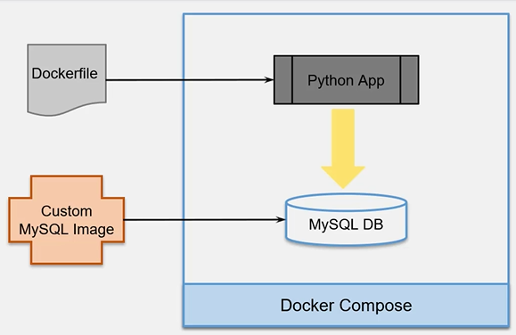

Build-Ship-Run
CNCF (Cloud Native Computing Foundation)

[Docker Docs](https://docs.docker.com/)

## Examination 
#### Topics

| Name of domain                          | %   |
| --------------------------------------- | --- |
| Orchestration                           | 25  |
| Image Creation, Management and registry | 20  |
| Installation and configuration          | 15  |
| Networking                              | 15  |
| Security                                | 15  |
| Storage and volumes                     | 10  |


## Briref history
* Mainframe to PC
* Baremetal to Virtual
* Datacenter to Cloud
* Host to Container (inc. Serverless)
#OpenContainerInitiative
###  OCI Open container initiative Standard
[Open Container Initiative - Open Container Initiative (opencontainers.org)](h
```embed
title: "Open Container Initiative - Open Container Initiative"
image: "https://opencontainers.org/img/logos/logo_lf_projects.svg"
description: "The Open Container Initiative is an open governance structure for the express purpose of creating open industry standards around container formats and runtimes."
url: "https://opencontainers.org/"
```

Table comparisson for docker alternatives
[Local container runtimes in 2023, tools for running containers for local dev - Google Sheets](https://docs.google.com/spreadsheets/d/1ZT8m4gpvh6xhHYIi4Ui19uHcMpymwFXpTAvd3EcgSm4/edit#gid=0)

## Docker components
### Intro


Dockerr images  and the way to compose it comes from [[OCI Image standard]]
The default container format is **libcontainer** and combines the following:
* [[namespaces]]
* [[cgroups]]
* veth
* iptables
* union mount


* Docker Images Read-only template with instrctions for createing a docker container
* **Container:** Runnable instance of an image
* **Networks:** Network interface to connect the container to external networks using the host machine's network connection
* **Volumes:** Mechanism for persisting data generated by and used by containers
* **Registry:** Private or public registry for Docker images
* **Services:** enablkes multi-host, multi-container deployment

___
Docker containers can run inside virtual machines
**Capacity optimization** A physical server can host VMs that may house Docker hosts, but may also host any number of traditional monotlithic VMs


___
Other sources
* [get.docker.com](get.docker.com) Gets a bash script to install docker
* [test.docker.com](test.docker.com)
* [https://labs.play-with-docker.com/](https://labs.play-with-docker.com/)
* [udemy-docker-mastery/intro/quick-container-run/quick-container-run.md at main · BretFisher/udemy-docker-mastery (github.com)](https://github.com/BretFis
* her/udemy-docker-mastery/blob/main/intro/quick-container-run/quick-container-run.md)

### Namespaces
* Wraps a global system resource in an abstraction (isolated workspace)
* Limits what a container can see (own view of the system)
* Process ID, N/W Interfaces, Inter-process Communications, Filesystem mount points

### Control groups (cgroups)
* Share available hardware resources to containers and optionally enforce limits and constraints
* Limits how much a container can use (metering & limiting)
* Memory, CPU, block, I/O, network

## Docker containers

Containers Are namespaces, created after an instance of an image
on ip address
process list
container rusn isolated, no one can see from each other

## Docker Images
Application binaries and dependencies (The rest core kernel is provided by kernel)

> An image is an ordered collection of root filesystem changes adn the corresponding execution parameters for use within a container runtime.


Building blocks through which containers are built. Binaries
* Read-only template with instructions for running a docker container
* Writable layer gets created once a container is spun from an image
* Repositories hold multiple images
* Registry stores repositories


### Layered file system
* Docker uses UnionFS (Union File System) for implementing the layered docker images
* The resulting filesystem contains files and subdirecotries from any or all the underlying filesystems
* Any update on the image, adds a new layer
* All changes made to the running container are written to the writtable layer

![[ImageArchitecture.png]]

```bash
docker push
docker pull
docker image build
docker images
docker image ls
docker image ls --no-trunc
docker image ls mongo
# filter images
docker image ls --filter "before=<imageid>"
docker image ls --filter "since=<imageid>"
docker images ls --filter "since=<imageid>"
docker image ls --filter "dangling=true"
docker image ls --format "{{.ID}}:{{.Repository}}"
# Remove images
docker image rm
docker image prune
docker image prune --all
docker image ls

```

### Inspect images
```bash
docker image inspect <image_id>
```

### Image tagging
When there are multiple tags of the same image (same image id) then after run 
```
docker image rm <image_name>:<tag>
```
Then the result will be "image" untagged
```bash
docker image tag redis:latest asahicantu:latest
docker image tag tomcat:latest tomcat:1.1
```

### Image repositories
* User repository
* Top level repository
```bash
docker search repo_name
docker pull ubuntu:latest
```

### Building image using Dockerfile
* Dockerfile contains a series of instructions paired with arguments
* Each instruction should be in upper-case and followed by an argument
* Instructions in the Dockerfile are processed top-down
* Each instruccion adds a new layer to th eimage and then commits the image
* Upon running, changes made by an instruction make it to the container
* If Dockerfile stops for some reason, you will be left with a working image (Until the point of failure)
```DOCKERFILE
FROM ubuntu:18.10
LABEL maintainer="asahicantu@mail.com"
RUN apt-get update
RUN apt-get upgrade
RUN apt-get install -y nginx
COPY index.html /usr/share/nginx/html/index.html
ENTRYPOINT ["/usr/sbin/nginx", "-g", "daemon off;"]
EXPOSE 80
```

### Building an image
The build is run by the Docker Daemon, not CLI
The process sends the entire context (recursively) to the daemon
```bash
docker build
# Builds a set of files at the specified location in local filesystem or URL <git repository location>
# The build is run
docker build -t asahicantu/nginx:1.0 .
docker run -itd --rm -p 800:80 asahicantu/nginx:1.0
docker image history
docker image history asahicantu/nginx:1.0
```

### Build image using docker commit
* Create a new image from a container changes
* By default the cotainer being commited and its processes will be paused while the image is committed
* If undesired, set the --pause=false option
* --message option commits a message
* --author provides author of the image
* --change option applies Dockerfile isntructions to the image
```bash
docker commit

docker container commit
docker container commit --message="Message" --author="Author name" nginx_master repo_name/server_n:1.0
docker image inspect  repo_name/server_n:1.0
```

### Push images to Docker Hub
```bash
docker login
docker push repo_name/server:1.0

```


## Dockerfile
### Dockerfile instructions
* .dockerignore file contains files and folders to be excluded when building a container
```
.*
README*
docker-compose.yml
*.yaml
```
___

![[Dockerfile Example]]

Parser directives
* Are optional and instruct docker daemon how to handle the content in Dockerfile
* Must be at the very top of a Dockerfile
* Currently escape and syntax are the only supported directives '# escape=`` '
* Written as a special type of comment in the form  '# directive=value'
* Do not add layers to the build and will not be shown as a build step
* Parser irectives are case-insensitive; convention is for them to be lowercase
* A single directive can only be used once
___


Refer to [Dockerfile reference | Docker Documentation](https://docs.docker.com/engine/reference/builder/) for more information

### Creating docker replicas
```bash
docker swarm init
docker service create --replicas 3 --name testnginx nginx
docker service ls
docker service inspect testnginx --pretty
```

### Docker-in-Docker
```bash
docker run -itd --rm --name manager --hostname manager --privileged -v //var/run/docker.sock:/var/run/docker.sock  docker


```


* MAnagers maintain a consistent internal state of the entire swarm
* IF the swarm loses quourum of managers, it cannot perform management tasks
* should maintiain an odd number of managers to support manager node failures
* A N manager cluster tolerates the loss of at most (N-1)/2 managers


| Swarm size | Majority |  Fault Tolerance  |
|--------|-------|------|
|1|1|0|
|2|2|0|
|3|2|1|
|4|3|1|
|5|3|2|
|6|4|2|
|7|4|3|
|8|5|3|
|9|5|4|

### Services
Tasks to execute on Manager or Worler nodes
Declarative model for services
Scaling
Desired state reconciliation
Service Discovery
Rolling updates
Load balancing
Internal DNS component


Image layers
Docker image buld -t nginx_cust

```yaml
FROM python
RUN pip install flask
WORKDIR /app
COPY . .
CMD python app.py

```

```bash
docker build
```

## Docker Compose
Is a tool for defining and running multi-container Docker applications
Allows the use of YAML to configure applications services
With a single command it allows to start all the services with a single configuration

1. Build container image
2. Define services that make up the application
3. Start the entire app
___
### Install docker compose
Can be used with docker swarm 1.13
Useful for local developments
```bash
docker-compose
docker compose up -d
docker compose down
```

```yaml
version: 3.1

services: # Containers, docker run...
	servicename: # Friendly name
		image: # Optional if build is used
		command: # Optional, replace the default CMD specified by the image
		environment: # Optional, same as -e in docker run
			ENV_VAR_NAME: example
		volumes: # Optional, same as -v in docker run
			- .:/site
			- ./nginx.conf:/etc/nginx/conf.d/default.conf:ro
		ports:
			- 80:8080
		depends_on:
	servicename2:
volumes: # optional
networks: #optional
```
```bash
sudo curl -L https://github.com/docker/compose/releases/download/<compose_version> /docker-compose-$(uname -s)-$(uname -m) -o /usr/local/bin/docker-compose
# add executable permissions to the binary
# test the installation
```



```bash
cd Resources/DockerCompose/mysql
docker build -t asahicantu/peopledb .
docker compose build
docker compose up
docker compose down
```

## Docker Network
* [[#Bridge network connection]]
* [[#Host Network connection]]
* [[#None Network Connection]]
* Overlay

```bash
docker network ls
# run ip add show or ifconfig on the docker host
ip add show
ipconfig
```

* Unless specified,  the containers connect to docker0 network once spun
* The bridge network represents docker0 network on the host and is the default
___
Containers are run on a separate network stack, internal to the Docker host.
Share the external ip address of the host through the use of NAT
* Uses DHCP for automatic address asignment


 
 
### Bridge network connection

Docker automatically creates a masquerade rule, for each container that lets containers connect to external network.
Is assigned by running -p command internally
```bash
docker network inspect bridge
docker run -itd --name=nginx1 -p 80 nginx
docker run -itd --rm --name nginx3 -p 32000:80 nginx
docker run -itd --rm --name tompcat1 -p 40000:8080 tomcat 
```

### Host Network connection
Does not require port specification, it rather exposes to the external network the ports that are currently used by the containers to be run
```bash

docker run -itd --rm --network=host --name nginx4 nginx
docker run -itd --rm --network=host --name tomcat2 tomcat
docker network inspect host
docker inspect nginx4

```

### None Network Connection
* Containers lack network interface
```bash
# Get information about none network:
docker network inspect none
docker run -it -d --net=none -p 8080 --name tomcat1 tomcat 
docker exec -it tomcat1 bash
```

#### Remove and add network to existing containers
Can be done through the use of docket inspect and docker network

```bash
docker run -itd --network none --name tomcat1 -p 8080 --hostname tomcat1 tomcat
docker inspect $(docker ps -q)
docker inspect tompcat1
#Disconnect the none network
docker network disconnect none tomcat1
docker inspect tomcat1
#Add bridge network
docker network connet bridge tomcat1
docker inspect tomcat1
```

### Overlay Network connection

* Is a computer network build on top of another
* Creates a distributed network among multiple Docker daemon hosts, on top of the host-specific networks
* Allows containers, connectod to it, to communicate securely
* Multiple new networks can be created
* Networks can be added or removed from containers without the need to restart them
* In case of multiple networks, external connectivity is from the first network

```bash
docker network create --driver=bridge new_bridge1
docker network create --driver=bridge --subnet=172.99.11.0/24 --gateway=172.99.11.1 new_bridge2
docker network ls
docker network inspect <network id or name>

```

#### List, create, inspect and remove new networks

Predefined networks cannot be removed

```bash
docker run -itd --name=testnginx --net=bridge -p 80 nginx
#Check ip address and external connectivity
docker inspect testnginx 
docker network create --driver bridge --subnet=172.99.101.0/24 --gateway=172.99.101.1 new_bridge3
docker network disconnect bridge testnginx
docket inspect testnginx
docket network connect new_bridge3 testnginx
docker inspect testnginx
# remove all unised newtorks
docker network prune
```

### Launch container in desired networks

```bash
docker network create --driver bridge --subnet 192.168.0.0/16 --gateway 
192.168.0.1 custom1
docker network create --driver bridge --subnet 172.100.0.0/16 --gateway 172.100.0.1 custom2
docker network connect custom2 tomcat1
#Docker only allows a single network to be instantiated when createing a container
docker run -itd --rm --name tomcat1 --network=custom1 -p 1000:8080 tomcat
#But further networks can be created once the container is running
docker network connect bridge container1
```

### Create a container but do not started after connecting it to two networks
```bash
docker create -it --rm --name=tomcat2 --network=custom1 -p 3000:8080 tomcat
docker network connect custom2 tomcat2
docker start tomcat2
docker exec -it tomcat2 bash
```

## Docker registries
Docker.io
Ghcr.io
Quay.io

## Docker Images
Image layers,  SHA Hash (Hash of hashes)

```
docker push
docker pull


Principle of separation of concerns
Persistence

volumes need manual deletion

* Local storage for containers
	* Provided for the docker image run
	* Uses 'Storage Drivers' to read the filesystem layers from a container
* Persistent Data Storage
	* Saving data beyond the container lifecycle
	* Data is stored outside the container boundaries
* StaticImage Storage
	* Storing images in registry
	* Images are not running

There are multiple storage drivers in Docker
Copy-on-write (CoW) is a strategy of sharing and copying filed for maximum efficiency


Size: Data on the writable layer
Virtual size: read-only image data + writable layer size
Total disk space used by all of the running containers on disk is some combinations of each container's size and the overall virtual size values

```bash
docker ps -s
docker ps -s --format 'table{{.Names}}\t{{.Image}}\t{{.Size}}'
# show docker disk usage
docker system df
#verbosity
docker system df -v
docker info | grep "Storage Driver"
```

___
### Storage drivers

[https://docs.docker.com/storage/storagedriver/select-storage-driver/](https://docs.docker.com/storage/storagedriver/select-storage-driver/)

| Type         | Access level | Description                                          |
| ------------ | ------------ | ---------------------------------------------------- |
| Overlay2     | File         | Uses memory more efficiently                         |
| Aufs         |              |                                                      |
| DeviceMapper | Block        | Better for heacy workloads write ops                 |
| Btrfs        | Block        | Better for heacy workloads write ops                 |
| Vfs          |              |                                                      |
| Zfs          | Block        | good choice for high-density workloads such as PaaS. |
|              |              |                                                      |
|              |              |                                                      |
- `overlay2` operates at the file level rather than the block level. This uses memory more efficiently, but the container's writable layer may grow quite large in write-heavy workloads.
- Block-level storage drivers such as `devicemapper`, `btrfs`, and `zfs` perform better for write-heavy workloads (though not as well as Docker volumes).
- `btrfs` and `zfs` require a lot of memory.
- `zfs` is a 

#### To change storage driver:
* Export data
* Stop docker
* Edit (or create new) /etc/docker/daemon.json
* Start docker
* Check Docker Info
* Import data
```bash
systemctl stop docker
cd /etc/docker
vi daemon.json
```

___
daemon.json
```json
{
	"storage-driver" : "devicemapper"
}
```


```bash
systemctl start docker
systemctl status docker
docker info | grep  "Storage Driver"

```

#### Change storage driver using dockerd
```bash
systemctl stop docker
dockerd --info
cd /etc/docker/
rm daemon.json
dockerd --storage-driver devicemapper
```

### Persistent storage
* Downside of storing data within the writable layer of container
	* Data does not persist when conainer is removed
	* Writable layer is tightly couplet to the host machine
	* Performance impact for write-heavy workloads

* Volumes provide persistent storage
* Allow to share data among containers
* Can be managed using Docker CLI commands or the Docker API
* Volume does not increase the size of the containers using it

Docker volume plug-in allow you to provision and mount shared storage such as iSCSI, NFS, FC
Data is translated by Volume Driver plug-in, which is then accessed by the Containers


### Manage application data
* Volumes 
	* Stored in th Docker Managed filesystem of the host
	* Supports the use of Volume Drivers
* Bind mounts
	* Stored anywhere on the host system
* tmpfs mounts
	* Stored in the host system;s memory 


```bash
docker volume create test_volume
docker run -itd  --volume test_volume:/app --name master nginx
docker exec master bash
cd app
apt upgrade
apt install vim
touch file
vim file "This is a test file"
echo "This is another file" > log.log
docker volume inspect test_Volume
docker volume rm test_volume
docker rm master
docker volume rm test_volume
#can also create volumes automatically
docker run -itd --rm --volume test_vol2:/app2 --name master nginx
docker run -itd --rm --mouht source=test_vol2,target=/appl2 --mount source=test_vol3,target=/appl3 --name master nginx
docker volume prune

```
Generated file can be located at:
\\wsl.localhost\docker-desktop-data\data\docker\volumes\test_volume\_data

### Docker Bindmounts

* A file or directory on the host machine is mounted into a container
* Can't use Docker CLI commands to directlly manage bind mounts
* Sharing configuration files, source code or artifacts from the host machine to containers
* Difference between --volume  (creates the volume) and --mount (infers existence) behaviour
```bash
docker run -itd --rm --volume /home/mount/test_vol3:/app --name master nginx
docker exec -it master bash
cd app
echo "fssdf" > file.txt
docker run -itd --rm --mount type=bind,source=/var/lib/docker/volumes/test_vol3/_data/config.txt,target=/app/config.cfg --volume /home/mount/test_vol3:/app --name master2 nginx
```

### Tmpfs mounts
* Temporary, only persists in the host memory
* When container stops, tmpfs mount is removed
* If a contianer is commited, the tmpfs mount is not saved
* Available only in Docker on Linux
```bash
docker run -itd --tmpfs  /app tomcat
docker run -itd --mount type=tmpfs,destination=/app  tomcat
```
### External storage
* Volume plug-ins enable engine deployments to be integrated weith external storage systems
* Enables data volumes to persist beyond the lifetime of a single Docker host
* List of Available Volume Plugins [here](https:://docs.docker.com/engine/extend/legacy_plugins)
* Use existing drivers or write new drivers to allow underlying storage to interface with docker


## Docker Swarm
Group of machines that are running Docker and joined into a cluster, can be physical or virtual
* Secure by default
* No need to install additionall tools
* Swarmkit is builtin

```bash
docker swarm
docker node
docker service
docker stack
docker secret
```

### Orchestration
#### Managers
Handle clusters
TLS/Certificate Authority
Encrypt the traffic
Managers can be workers
##### Manager node elements
Running in raft mode
###### API
Accepts command from client and creates service object
###### Orchestrator
REconciliation loop for service objects and creates tasks
###### Allocator
Allocates IP Addresses to tasks
###### Scheduler
Assignes nodes to tasks
###### Dispatcher
Checks in on workers (health)
#### Workers
Receive an executable task
Contain TLS
##### Worker
Connects to dispatcher to check on assgned tasks
##### Executor
Executes the tasks assigned to worker node


#### Services
Collection of replicas that contain a task
each task has embedded a container
#### Tasks
Containers that run in managers or workers


### Overlay Multihost networking
for container to container traffic inside a single swarm
optional IPSEC (AES) encryption on network creation
Each service cna be connected to multiple networks
`--driver overlay`
### Routing mesh
runs at OSI layer 3 (TCP)
* ingress (incoming) oackets for a service to proper Task
* spans all nodes in swarm
* uses IPVS from linux kernel
* load balances swarm services across their Tasks
* two ways this works
	* container to container in anoverlai network VIP
	* external traffic incoming to published porta (all nodes listen)


An entire swarm can be build from docker images
By default manager nodes alsu run services as worker nodes
Standalone containers can still run on any of the Docker hosts participating in the swarm


#### `docker swarm init`
* Creates PKI and security automation
	*  Root signing certificates created for swarm
	*  Certificate is sissued for first manager node
	* Join tokens are created
 * Raft database created
	 * Encrypted by default
	 * No need for another key/value system to hold orchestration secrets
	 * Replicates logs amongst managers via mutual TLS in "control plane"
		 
 

```bash

docker swarm init --advertise-addr <ip-addr>
docker swarm join-token manager
docker swarm join-token worker
docker node promote <node-id>
docker swarm leave -f
docker service create --type=global
```
### Docker Stacks
Next layer to use compose with services in swarm
Swarm cannot build images - ignores it
`docker stacks deploy`


### Docker secrets
Only containers in assigned services can see them
they live in memori fs
a secret can have aliases
run on `/run/secrets/<secret-name>` 


## Docker UCP
* Enterprise tool, 
* Runs globally schedules service call ucp agent
* Controls the node and manage UCP Serices based on whether the node is manager or worker node
* runs several containers on the nodes
	* Manager node - UCP Components, Web-UI and DataStore
	* Worker node - Proxy service for authorization and subset of containers

```bash
docker container run --rm  -it --name ucp -v /var/run/docker.sock:/var/run/docker.sock docker/ucp:latest install --interactive
```

ucp-agent shcedules call runs globall
	runs several containers on the nodes
	Manager node = all UCP + WebUI Datastore
	Workernode = proxy service for authorization and subset of containers
	

### RBAC
Users, teams and organizations
**Allows LDAP**

#### Define custom roles
#### Create grants (subject + role + resource set)
![[Pasted image 20230919174539.png]]

#### Group cluster resources
##### Roles
Restricted Control
Full Control
Scheduler
View Only
![[Pasted image 20230919174701.png]]

#### Create grants
![[Pasted image 20230919174815.png]]

### UCP Client bundle
Access UCP API through CLI client with a **client bundle**
Contains <font color="#ffff00">private and public keys</font> to authorize requests in UCP
Can be downloaded from the UCP Interface
Contains utility scripts to configure Docker and KyubeCTL Tools to Talk to UCP

#### Certificates
CA used for all internal communication betweeen managers and workers Mutual TLS
CA for en user communication


## DTR Docker Trusted Registry
Image storage solution
Installed behind firewall
Web based UI to browse docker images and review repo events
Can be installed on-prem or on the cloud
	Requires 80 and 443 ports for TCP
Same authentication mechanism as UCP
	LDAP Sync
	RBAC

#### Security
Shares authentication with UDP
Stores metadata layer and data in 2 separate locations

External certificates can be addded to DTR

#### Storage
##### Filesystem
NFS (Network File System), volumes, images or 
##### Cloud
Amazon S3
Azure
OpenStack Swift
Google Cloud Storage

#### Garbage collection
Unreferences imades and layers are removed
Job run: Until done, For x minutes, Never
![[Pasted image 20230919182747.png]]

#### Networks
dtr-ol = overlay

#### Monitor:
* /_ping   - Load balancing
* /nginx_status
* /api/v0/meta/cluster_status  - Health status
## Backup
`/etc/docker/daemon.json`
### Swarm
`/var/lib/docker/swarm`
	Stores state and manaer logs
If autolock, retrieve the unlock key. 
Stop docker and take a backup od the swarm dir.
### UCP
<font color="#ffff00">CREATES A TAR ARCHIVE</font>
run `docker/ucp backup` command on a single UCP manager
Restore from backup recovers 
	Users, teams, permissions
	Configuration options (Subscriptions, scheduling, content trust and authentication backends)
	
### DTR

Can join multiple DTR Replicas for HA (n/2+1) = healhty cluster
Failure scenarions
1. Replica is unhealthi but cluster maintains quorum
2. Cluster loses quorum but at least one replica is healthy
3. All replicas are unhealthy

run `docker/dtr backup` 
Takes backup of
	Configurations, repository metadata, access control, notary data, scan results and certificates/keys


## Security scanning
* Binary scan on each layer
* Identifies software components
* Indexes SHA
* Compares SHA of each component against CVE db


##### Enable image scanning from DTR
Online mode:  DTR contacts docker servcer, downloads latest vulnerability db
Offline mode: Upload and install security DB
![[Pasted image 20230919183247.png]]

## Image signing and docker content trust
Digitally sign the images to validate its genuineness
UCP can prevent untrusted images from being deployed
Componentes
	Notary server
	Notary signer
Enable signing and content trust
DOCKER_CONTENT_TRUST=1
`export DOCKER_CONTENT_TRUST=1`
`docker pull --disable-content-trust`

UCP can allow to run unly signed images
![[Pasted image 20230919183815.png]]

## Swarm security with MTLS
CA on the manager node
Worker and manager node tokens include the digest of the root CA's certificate and random gen secret
New node joining the swarm, the manager issues a certificate to the node
The swarm nodes use  MTLS Mutual transport Layer security to authenticate, authorize and encrypt communications
`docker swarm ca --rotate` to generate CA certificate adn key
## Docker security
* Scan docker host 
	* use docker-bench-security (selinux)
* A container in docker apparmor seccomp profiles  `--privileged`
* Do not run containers as root  `docker top <containerid>`
	* use `useradd <username>`
	* if app is root they attacker might run any app as root
	* Use DOCKERFILE USER 
* enable user namespaces
* code repo scanning
	* use snyk (opensource)
	* trivy
	* microscanner
* image scanning
	* Scan during image build
* runtime and bad behaviour monitoring
	* [Falco – Sysdig](https://sysdig.com/opensource/falco/)
	* [Content trust in Docker | Docker Docs](https://docs.docker.com/engine/security/trust/)
	* [Seccomp security profiles for Docker | Docker Docs](https://docs.docker.com/engine/security/seccomp/)
	* [AppArmor security profiles for Docker | Docker Docs](https://docs.docker.com/engine/security/apparmor/)
* rootless mode
	* run docker deamon without root
* windows containers?
* content trust
* do not run other peoples images
* do not enable docker TCP socket unless it is secured
* image scanning
* distroless images

## Docker Swarm logs
`docker service logs
`/etc/docker/daemon.json`
```bash
vi /etc/docker/daemon.sjon
# Write this in vi program
{
 "log-driver": local
}
# restart the systen]
sudo systemctl restart docker

```
supported drivers:
	-  json-file (default)
	- none
	- local
	- splunk
	- journald
	- syslog


docker plugin install - additional logging drivers
### Kernel namespaces
* limit the scope per container

### Control groups
* limit containers resource usage