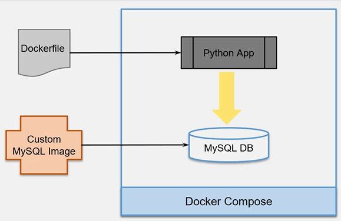

Is a tool for defining and runnign multi-container Docker applications
Allows the use of YAML to configure applications services
With a single command it allows to start all the services with a single configuration

1. Build container image
2. Define services that make up the application
3. Start the entire app
___
## Install docker compose
```bash
sudo curl -L https://github.com/docker/compose/releases/download/<compose_version> /docker-compose-$(uname -s)-$(uname -m) -o /usr/local/bin/docker-compose
# add executable permissions to the binary
# test the installation
```



```bash
cd Resources/DockerCompose/mysql
docker build -t asahicantu/peopledb .
docker compose build
docker compose up
docker compose down
```