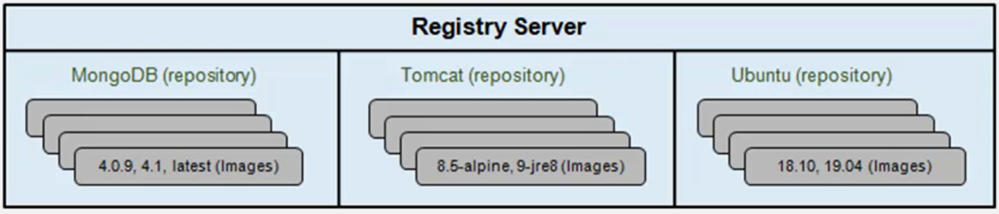
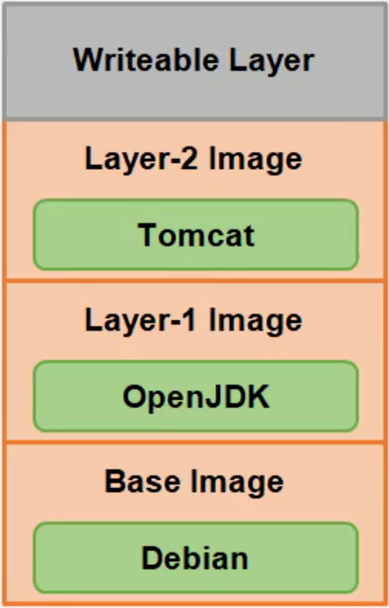

Are the building blocks through which containers are built.
* Read-only template with instructions for running a docker container
* Writable layer gets created once a container is spun from an image
* Repositories hold multiple images
* Registry stores repositories


### Layered file system
* Docker uses UnionFS for implementing the layered docker images
* The resulting filesystem contains files and subdirecotries from any or all the underlying filesystems
* Any update on the image, adds a new layer
* All changes made to the running container are written to the writtable layer


```bash
docker images
docker image ls
docker image ls --no-trunc
docker image ls mongo
# filter images
docker image ls --filter "before=<imageid>"
docker image ls --filter "since=<imageid>"
docker images ls --filter "since=<imageid>"
docker image ls --filter "dangling=true"
docker image ls --format "{{.ID}}:{{.Repository}}"
# Remove images
docker image rm
docker image prune
docker image prune --all
docker image ls

```

## Inspect images
```bash
docker image inspect <image_id>
```

## Image tagging
When there are multiple tags of the same image (same image id) then after run 
```
docker image rm <image_name>:<tag>
```
Then the result will be "image" untagged
```bash
docker image tag redis:latest asahicantu:latest
docker image tag tomcat:latest tomcat:1.1
```

## Image repositories
* User repository
* Top level repository
```bash
docker search repo_name
docker pull ubuntu:latest
```

## Building image using Dockerfile
* Dockerfile contains a series of instructions paired with arguments
* Each instruction should be in upper-case and followed by an argument
* Instructions in the Dockerfile are processed top-down
* Each instruccion adds a new layer to th eimage and then commits the image
* Upon running, changes made by an instruction make it to the container
* If Dockerfile stops for some reason, you will be left with a working image (Until the point of failure)
```DOCKERFILE
FROM ubuntu:18.10
LABEL maintainer="asahicantu@mail.com"
RUN apt-get update
RUN apt-get upgrade
RUN apt-get install -y nginx
COPY index.html /usr/share/nginx/html/index.html
ENTRYPOINT ["/usr/sbin/nginx", "-g", "daemon off;"]
EXPOSE 80
```

## Building an image
The build is run by the Docker Daemon, not CLI
The process sends the entire context (recursively) to the daemon
```bash
docker build
# Builds a set of files at the specified location in local filesystem or URL <git repository location>
# The build is run
docker build -t asahicantu/nginx:1.0 .
docker run -itd --rm -p 800:80 asahicantu/nginx:1.0
docker image history
docker image history asahicantu/nginx:1.0
```

## Build image using docker commit
* Create a new image from a container changes
* By default the cotainer being commited and its processes will be paused while the image is committed
* If undesired, set the --pause=false option
* --message option commits a message
* --author provides author of the image
* --change option applies Dockerfile isntructions to the image
```bash
docker commit

docker container commit
docker container commit --message="Message" --author="Author name" nginx_master repo_name/server_n:1.0
docker image inspect  repo_name/server_n:1.0
```

## Push images to Docker Hub
```bash
docker login
docker push repo_name/server:1.0

```

## Dockerfile instructions
* .dockerignore file contains files and folders to be excluded when building a container
```
.*
README*
docker-compose.yml
*.yaml
```
___
Parser directives
* Are optional and instruct docker daemon how to handle the content in Dockerfile
* Must be at the very top of a Dockerfile
* Currently escape and syntax are the only supported directives '# escape=`` '
* Written as a special type of comment in the form  '# directive=value'
* Do not add layers to the build and will not be shown as a build step
* Parser irectives are case-insensitive; convention is for them to be lowercase
* A single directive can only be used once
___

Dockerfile
Refer to [Dockerfile reference | Docker Documentation](https://docs.docker.com/engine/reference/builder/) for more information
```Dockerfile
# Author of dockerfile
MAINTAINER
# Defines a variable that users can pass at buil-time using --build-arg <var_bane>=<value>. Can include default value
ARG CODE_VERSION=latest
# Specifies the base image from which to build any docker. Can be precedede by oner or mor ARG instructions. Can appear multiple times in a single Dockerfile
FROM base:${CODE_VERSION}
#Executes a command in a new layer on top of the current image and commits the results
# The new image willb e parent image for the next step in the Dockerfile
RUN apt-get update
RUN apt-get install -y ningx
RUN <shell command> <param1> <param2>
RUN ["executable", "param1", "param2"]
#Provides defaults for an executing container Specifies the command to run when a container is launched
#When used with ENTRYPOINT CMD provides the default parameters
#There can only be ONE CMD Instruction in a Dockerfile
CMD <shell command> <param1> <param2>
CMD ["executable", "param1", "param2"]
## Sets the command and parameters that will be executed fgirst when a container is run
## Command line arguments passed with docker run append the ENTRYPOINT and override the CMD elements in the Dockerfile
# There can only be one ENTRYPOINT instruction in a Dockerfile
ENTRYPOINT <command> <param1> <param2>
ENTRYPOINT ["executable", "param1", "param2"]
# Set environment variables one or more
ENV KEY=VALUE
#Set working directory for the container. Set of instrutions which follow it. Can be used multiple times
WORKDIR
# Copies files/folder from local directory and adds them to the container at the path <dest>
# Containes special features like uncompression for files and remote urls 
ADD [source directory] [target directory]
ADD <source file> <target file>
ADD latest.tar.gz /var/www/wordpress
# Copies new files or directories from <src> and adds them to the filesystem of the container at the path <dest>
# 
COPY [source directory] [target directory]
COPY conf.d/ /etc/apache2/

#Specify the port to listen to
EXPOSE
# Sets user id (uid) or username when running the image
USER
#Creates a mount poiont
VOLUME


```