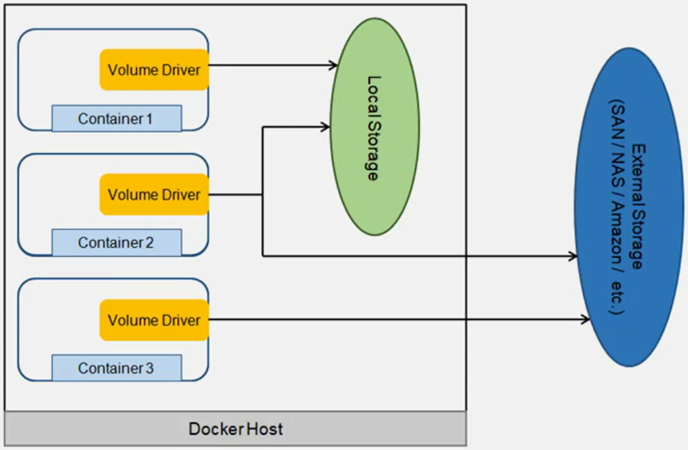
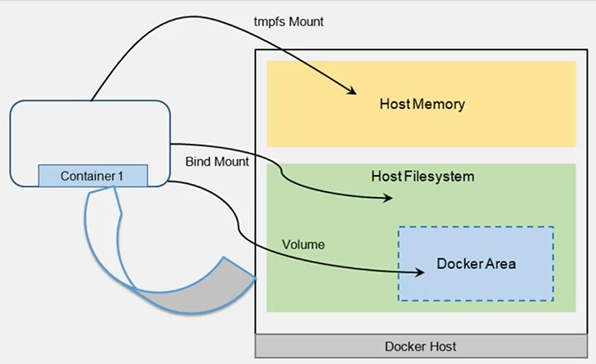

* Local storage for containers
	* Provided for the docker image run
	* Uses 'Storage Drivers' to read the filesystem layers from a container
* Persistent Data Storage
	* Saving data beyond the container lifecycle
	* Data is stored outside the container boundaries
* StaticImage Storage
	* Storing images in registry
	* Images are not running

There are multiple storage drivers in Docker
Copy-on-write (CoW) is a strategy of sharing and copying filed for maximum efficiency


Size: Data on the writable layer
Virtual size: read-only image data + writable layer size
Total disk space used by all of the running containers on disk is some combinations of each container's size and the overall virtual size values

```bash
docker ps -s
docker ps -s --format 'table{{.Names}}\t{{.Image}}\t{{.Size}}'
# show docker disk usage
docker system df
#verbosity
docker system df -v
docker info | grep "Storage Driver"
```

___
## Storage drivers
* Overlay2 - Preferred storage driver
* Aufs
* Devicemapper
* Btrfs & zfs
* Vfs
### To change storage driver:
* Export data
* Stop docker
* Edit (or create new) /etc/docker/daemon.json
* Start docker
* Check Docker Info
* Import data
```bash
systemctl stop docker
cd /etc/docker
vi daemon.json
```

___
daemon.json
```json
{
	"storage-driver" : "devicemapper"
}
```


```bash
systemctl start docker
systemctl status docker
docker info | grep  "Storage Driver"

```

### Change storage driver using dockerd
```bash
systemctl stop docker
dockerd --info
cd /etc/docker/
rm daemon.json
dockerd --storage-driver devicemapper
```

## Persistent storage
* Downside of storing data within the writable layer of container
	* Data does not persist when conainer is removed
	* Writable layer is tightly couplet to the host machine
	* Performance impact for write-heavy workloads

* Volumes provide persistent storage
* Allow to share data among containers
* Can be managed using Docker CLI commands or the Docker API
* Volume does not increase the size of the containers using it

Docker volume plug-in allow you to provision and mount shared storage such as iSCSI, NFS, FC
Data is translated by Volume Driver plug-in, which is then accessed by the Containers


## Manage application data
* Volumes 
	* Stored in th Docker Managed filesystem of the host
	* Supports the use of Volume Drivers
* Bind mounts
	* Stored anywhere on the host system
* tmpfs mounts
	* Stored in the host system;s memory 


```bash
docker volume create test_volume
docker run -itd  --volume test_volume:/app --name master nginx
docker exec master bash
cd app
apt upgrade
apt install vim
touch file
vim file "This is a test file"
echo "This is another file" > log.log
docker volume inspect test_Volume
docker volume rm test_volume
docker rm master
docker volume rm test_volume
#can also create volumes automatically
docker run -itd --rm --volume test_vol2:/app2 --name master nginx
docker run -itd --rm --mouht source=test_vol2,target=/appl2 --mount source=test_vol3,target=/appl3 --name master nginx
docker volume prune

```
Generated file can be located at:
\\wsl.localhost\docker-desktop-data\data\docker\volumes\test_volume\_data

## Docker Bindmounts

* A file or directory on the host machine is mounted into a container
* Can't use Docker CLI commands to directlly manage bind mounts
* Sharing configuration files, source code or artifacts from the host machine to containers
* Difference between --volume  (creates the volume) and --mount (infers existence) behaviour
```bash
docker run -itd --rm --volume /home/mount/test_vol3:/app --name master nginx
docker exec -it master bash
cd app
echo "fssdf" > file.txt
docker run -itd --rm --mount type=bind,source=/var/lib/docker/volumes/test_vol3/_data/config.txt,target=/app/config.cfg --volume /home/mount/test_vol3:/app --name master2 nginx
```

## Tmpfs mounts
* Temporary, only persists in the host memory
* When container stops, tmpfs mount is removed
* If a contianer is commited, the tmpfs mount is not saved
* Available only in Docker on Linux
```bash
docker run -itd --tmpfs  /app tomcat
docker run -itd --mount type=tmpfs,destination=/app  tomcat
```
## External storage
* Volume plug-ins enable engine deployments to be integrated weith external storage systems
* Enables data volumes to persist beyond the lifetime of a single Docker host
* List of Available Volume Plugins [here](https:://docs.docker.com/engine/extend/legacy_plugins)
* Use existing drivers or write new drivers to allow underlying storage to interface with docker