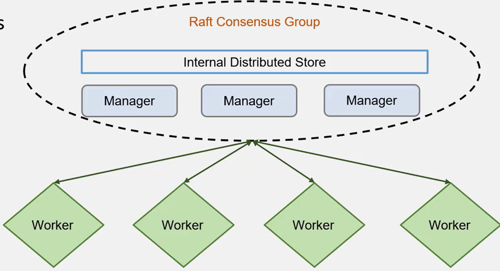

Orchestration


A swarm is a group of machines that are running Docker and joined into a cluster, can be physical or virtual
Secure by default
No need to install additionall tools
Swarmkit is builtin

A swarm consists of multiple docker hosts. Act as managers and workers
Manager nodes handle clusters
Worker nodes receive an executable task

An entire swarm can be build from docker images
By default manager nodes alsu run services as worker nodes
Standalone containers can still run on any of the Docker hosts participating in the swarm


```bash
# Manager-1 35.212.248.228
# Worker-1 35.212.192.14
# Worker-2 35.212.211.95
docker swarm init --advertise-addr 35.212.248.228
docker swarm join-token manager
docker swarm join-token worker
docker node promote rvp6w1ax0wc26222k4rxnndau
docker swarm leave -f

# docker swarm join --token SWMTKN-1-5xfo13lc39rz5pn2o3zeeudrgjjcrfhoii0ydh9atwuqdhs3qt-2epdtspzy7e6xa890049k2zjq 35.212.248.228:2377

#To add a manager to this swarm, run 'docker swarm join-token manager' and follow the instructions.

docker pull docker

```

### Creating docker replicas
```bash
docker swarm init
docker service create --replicas 3 --name testnginx nginx
docker service ls
docker service inspect testnginx --pretty
```

## Docker-in-Docker
```bash
docker run -itd --rm --name manager --hostname manager --privileged -v //var/run/docker.sock:/var/run/docker.sock  docker


```


* MAnagers maintain a consistent internal state of the entire swarm
* IF the swarm loses quourum of managers, it cannot perform management tasks
* should maintiain an odd number of managers to support manager node failures
* A N manager cluster tolerates the loss of at most (N-1)/2 managers


| Swarm size | Majority |  Fault Tolerance  |
|--------|-------|------|
|1|1|0|
|2|2|0|
|3|2|1|
|4|3|1|
|5|3|2|
|6|4|2|
|7|4|3|
|8|5|3|
|9|5|4|

## Services
Tasks to execute on Manager or Worler nodes
Declarative model for services
Scaling
Desired state reconciliation
Service Discovery
Rolling updates
Load balancing
Internal DNS component


