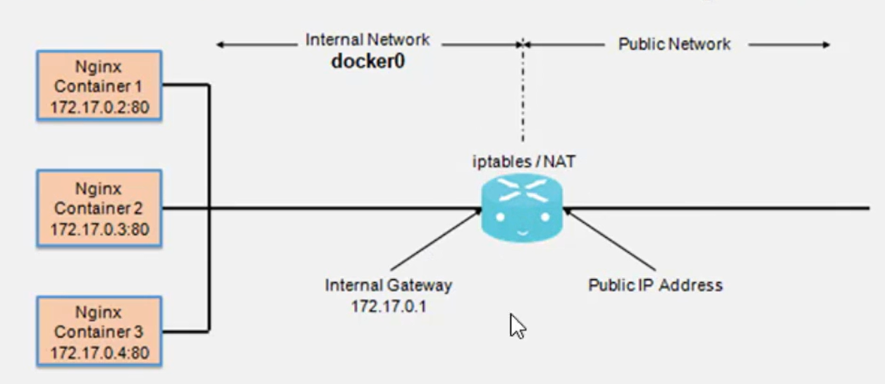
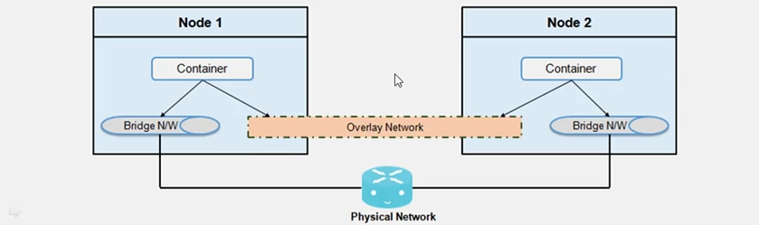

* [[#Bridge network connection]]
* [[#Host Network connection]]
* [[#None Network Connection]]
* Overlay

```bash
docker network ls
# run ip add show or ifconfig on the docker host
ip add show
ipconfig
```

* Unless specified,  the containers connect to docker0 network once spun
* The bridge network represents docker0 network on the host
___
Containers are run on a separate network stack, internal to the Docker host.
Share the external ip address of the host through the use of NAT
* Uses DHCP for automatic address asignment


 
 
## Bridge network connection

Docker automatically creates a masquerade rule, for each container that lets containers connect to external network.
Is assigned by running -p command internally
```bash
docker network inspect bridge
docker run -itd --name=nginx1 -p 80 nginx
docker run -itd --rm --name nginx3 -p 32000:80 nginx
docker run -itd --rm --name tompcat1 -p 40000:8080 tomcat 
```

## Host Network connection
Does not require port specification, it rather exposes to the external network the ports that are currently used by the containers to be run
```bash

docker run -itd --rm --network=host --name nginx4 nginx
docker run -itd --rm --network=host --name tomcat2 tomcat
docker network inspect host
docker inspect nginx4

```

## None Network Connection
* Containers lack network interface
```bash
# Get information about none network:
docker network inspect none
docker run -it -d --net=none -p 8080 --name tomcat1 tomcat 
docker exec -it tomcat1 bash
```

### Remove and add network to existing containers
Can be done through the use of docket inspect and docker network

```bash
docker run -itd --network none --name tomcat1 -p 8080 --hostname tomcat1 tomcat
docker inspect $(docker ps -q)
docker inspect tompcat1
#Disconnect the none network
docker network disconnect none tomcat1
docker inspect tomcat1
#Add bridge network
docker network connet bridge tomcat1
docker inspect tomcat1
```

## Overlay Network connection

* Is a computer network build on top of another
* Creates a distributed network among multiple Docker daemon hosts, on top of the host-specific networks
* Allows containers, connectod to it, to communicate securely
* Multiple new networks can be created
* Networks can be added or removed from containers without the need to restart them
* In case of multiple networks, external connectivity is from the first network

```bash
docker network create --driver=bridge new_bridge1
docker network create --driver=bridge --subnet=172.99.11.0/24 --gateway=172.99.11.1 new_bridge2
docker network ls
docker network inspect <network id or name>

```

### List, create, inspect and remove new networks

Predefined networks cannot be removed

```bash
docker run -itd --name=testnginx --net=bridge -p 80 nginx
#Check ip address and external connectivity
docker inspect testnginx 
docker network create --driver bridge --subnet=172.99.101.0/24 --gateway=172.99.101.1 new_bridge3
docker network disconnect bridge testnginx
docket inspect testnginx
docket network connect new_bridge3 testnginx
docker inspect testnginx
# remove all unised newtorks
docker network prune
```

## Launch container in desired networks

```bash
docker network create --driver bridge --subnet 192.168.0.0/16 --gateway 
192.168.0.1 custom1
docker network create --driver bridge --subnet 172.100.0.0/16 --gateway 172.100.0.1 custom2
docker network connect custom2 tomcat1
#Docker only allows a single network to be instantiated when createing a container
docker run -itd --rm --name tomcat1 --network=custom1 -p 1000:8080 tomcat
#But further networks can be created once the container is running
docker network connect bridge container1
```

## Create a container but do not started after connecting it to two networks
```bash
docker create -it --rm --name=tomcat2 --network=custom1 -p 3000:8080 tomcat
docker network connect custom2 tomcat2
docker start tomcat2
docker exec -it tomcat2 bash
```