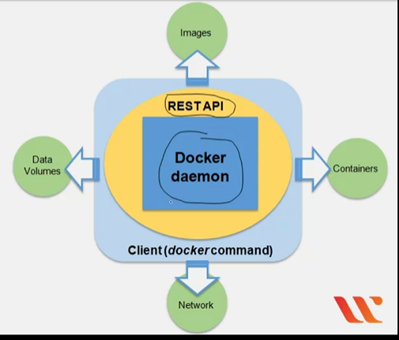
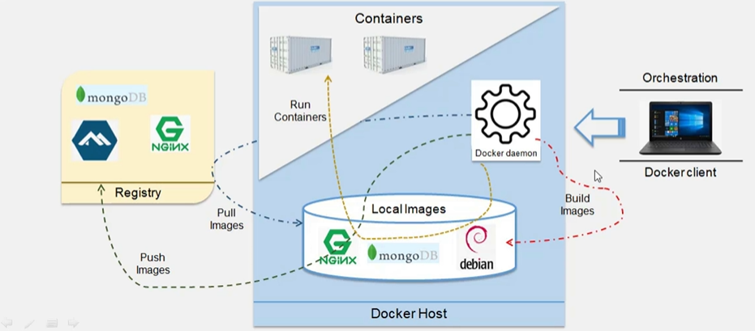
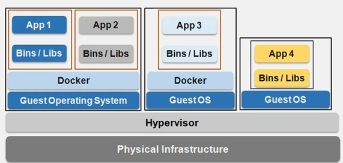

[[Docker certified developer/Dockerfile|Dockerfile]]

[[Docker Images]]

[[Docker Registries]]

[[Docker container]]
  
Build-Ship-Run
CNCF (Cloud Native Computing Foundation)

OCI Image standard

## Examination consists of
* Docker
* Docker Swarm
* Enterprise features
* Multiple choice questions (one or more coorect answers)

| Name of domain                          | %   |
| --------------------------------------- | --- |
| Orchestration                           | 25  |
| Image Creation, Management and registry | 20  |
| Installation and configuration          | 15  |
| Networking                              | 15  |
| Security                                | 15  |
| Storage and volumes                     | 10  |

## Docker components
* Docker Images Read-only template with instrctions for createing a docker container
* **Container:** Runnable instance of an image
* **Networks:** Network interface to connect the container to external networks using the host machine's network connection
* **Volumes:** Mechanism for persisting data generated by and used by containers
* **Registry:** Private or public registry for Docker images
* **Services:** enablkes multi-host, multi-container deployment

___
The default container format is **libcontainer** and combines the following:
### Namespaces
* Wraps a global system resource in an abstraction (isolated workspace)

* Limits what a container can see (own view of the system)
* Process ID, N/W Interfaces, Inter-process Communications, Filesystem mount points

### Control groups (cgroups)
* Share available hardware resources to containers and optionally enforce limits and constraints
* Limits how much a container can use (metering & limiting)
* Memory, CPU, block, I/O, network

___
Docker containers can run inside virtual machines
**Capacity optimization** A physical server can host VMs that may house Docker hosts, but may also host any number of traditional monotlithic VMs

___
Other sources
* [get.docker.com](get.docker.com) Gets a bash script to install docker
* [test.docker.com](test.docker.com)
* [https://labs.play-with-docker.com/](https://labs.play-with-docker.com/)
___ 
[[Docker Images]]
[[Docker Storage]]
[[Docker Compose]]
[[Networking]]
[[Docker Swarm]]
[[Commands]]

